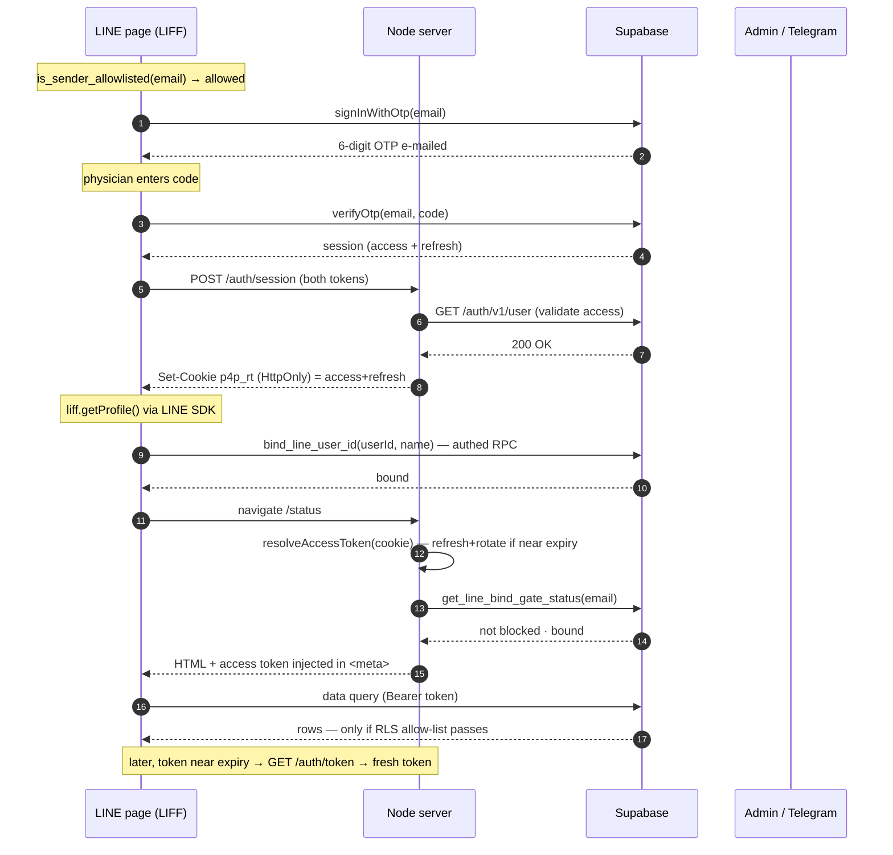
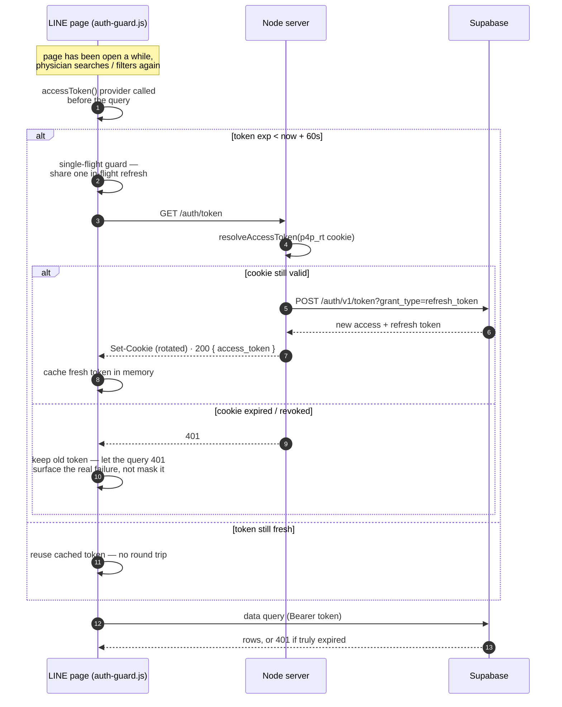

# Verification data flow

How a physician goes from opening the LINE app to reading gated data — email
OTP, the server-held session, LINE-account binding, and the per-request gate.

**The real security boundary is Supabase Row-Level Security** (see
`scripts/security-rls-auth.sql`). Everything described below on the client and
in `main.js` is routing and UX; a leaked anon key reads nothing on its own —
RLS is default-deny, gated by `is_current_user_allowlisted()`.

Actors: **LINE page** (LIFF in-app browser) · **Node server** (`main.js`,
Vercel) · **Supabase** (Auth + RLS data) · **Admin** (Telegram).

## A. End-to-end handoff

Happy path — who holds which token at each step, from OTP to an authorised
data query.



## B. Decision flow

Every branch: the allow-list, OTP, the bind escape-hatch, and the gate that
runs on each page load.

```mermaid
flowchart TD
    A([Open link in LINE]) --> G{LINE webview?}
    G -->|No| DESK[Show "open via LINE"]:::stop
    G -->|Yes| E[Enter e-mail]:::client

    E --> AL{is_sender_allowlisted?<br/>anon oracle RPC}:::decide
    AL -->|Not listed| REQ[Pick name → log_access_request]:::client
    REQ --> TG1[Telegram alert to admin]:::tg
    TG1 --> AD{Admin approves / rejects<br/>/telegram/webhook}:::decide
    AD -->|approve → added| E
    AD -->|reject| DESK

    AL -->|Listed| O1[signInWithOtp → OTP e-mailed]:::db
    O1 --> O2[Enter 6-digit code]:::client
    O2 --> VF{verifyOtp}:::decide
    VF -->|invalid / expired| O2
    VF -->|session| SE[POST /auth/session<br/>server validates → HttpOnly cookie]:::server

    SE --> BF[Bind: liff.getProfile → bind_line_user_id]:::client
    BF --> BOK{bind ok?}:::decide
    BOK -->|yes| DONE([Enter the page]):::done
    BOK -->|no| RC[record_bind_failure → attempts]:::db
    RC --> LM{attempts ≥ 3?}:::decide
    LM -->|no| RT[Show "try again"]:::client --> BF
    LM -->|yes| TG2[Telegram alert · let through]:::tg --> DONE

    DONE --> GATE{{Every gated request}}:::server
    GATE --> RA{resolveAccessToken<br/>cookie valid?}:::decide
    RA -->|no / refresh failed| BOUNCE[Redirect /verify<br/>reason = no_session · expired]:::stop
    RA -->|ok · rotate cookie| GS{get_line_bind_gate_status}:::decide
    GS -->|blocked| BLK[Clear cookie → /verify?reason=blocked]:::stop
    GS -->|unbound & under limit| SB["/verify?reason=bind_required<br/>silent re-bind"]:::server --> BF
    GS -->|ok| INJ[Inject token → auth-guard builds P4P.db]:::client
    INJ --> Q[Data queries — Supabase RLS enforces allow-list]:::db

    classDef client fill:#e8f7ee,stroke:#06c755,color:#14532d;
    classDef server fill:#efe7db,stroke:#4b3d33,color:#4b3d33;
    classDef db fill:#e7eef6,stroke:#3b6ea5,color:#1e3a5f;
    classDef tg fill:#e6f2fa,stroke:#229ed9,color:#0b4a6b;
    classDef decide fill:#f3e9d8,stroke:#a68966,color:#5b4a2f;
    classDef stop fill:#fbeae8,stroke:#c0392b,color:#7a2018;
    classDef done fill:#e9f5e9,stroke:#2f7d32,color:#1b4d1f;
```

## C. Token refresh on a long-open page

The injected access token is only good for ~1 hour. A page left open past
that no longer just holds a stale token — `assets/auth-guard.js` checks its
age before every query and asks the server for a fresh one on demand via
`GET /auth/token`.



## What actually protects the data

Everything the browser does — the allow-list check, the bind gate, the
injected token — is **routing and UX**. The enforcement is **Supabase
Row-Level Security**: data tables are default-deny, readable only by an
authenticated session whose e-mail is on the allow-list
(`is_current_user_allowlisted()`), with `blocked_emails` overriding. A leaked
anon key reads nothing.

The session lives **server-side** because LINE's in-app webview can't
reliably persist a client-side Supabase session. The browser only ever holds
a short-lived access token in memory; the refresh token stays in an HttpOnly
cookie (`p4p_rt`).

LINE binding is **best-effort with alerting**, not an absolute guarantee —
after `BIND_ATTEMPT_LIMIT` (3) failed attempts the physician is let through
with a one-time admin alert, so a device or permission fault never locks them
out. See `scripts/line-bind-gate.sql` and `verify/app.js`.

The refresh-token rotation in `resolveAccessToken()` (`main.js`) is safe under
concurrent requests only because Supabase's refresh-token reuse interval
tolerates reuse within a short grace window — see `OPERATIONS.md` for the
required dashboard setting.

---

Source of truth: `verify/app.js`, `assets/auth-guard.js`, `main.js`,
`scripts/*.sql`. These diagrams are a schematic — read the source for exact
error handling.
